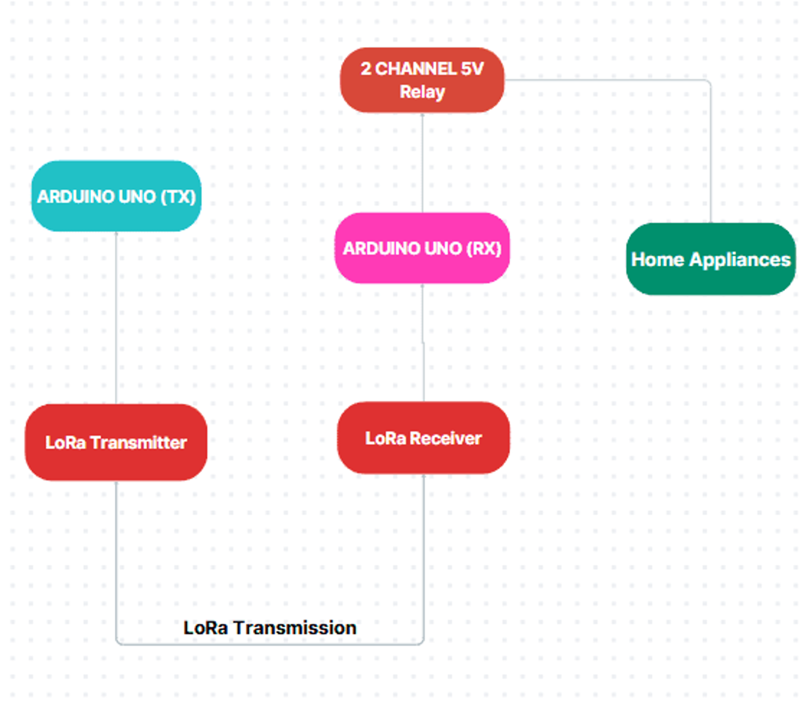

# LoRa-Based Home Automation

## Project Description
- This project demonstrates a home automation system using **LoRa module** and **Arduino UNO**.
- The LoRa module used in this project is from REYAX RYLR998.  
- It features a transmitter node with push buttons and a receiver node that controls relays to switch appliances like bulbs.  
- The system works over long distances using LoRa communication and can be extended for multiple devices.

---

## Components Used
- Arduino UNO  
- REYAX RYLR996 LoRa module  
- Resistors: 4.7kΩ, 10kΩ  
- Push buttons  
- 2-channel 5V relay module  
- 230V AC Bulb  

---

## Folder Structure 

LoRa-Based-Home-Automation/
├── README.md
├── Transmitter_Code/
│ └── transmitter.ino
├── Receiver_Code/
│ └── receiver.ino
└── Schematics/
├── block_diagram.png
├── circuit_diagram.png
├── output_demo.gif
└── output_demo.mp4

---

## Schematics

### Block Diagram

### Transmitter Circuit

### Receiver Circuit 

### Final Output

 
### Output Demo

### Output Full Video 

---

### How It Works

- Transmitter: Reads push button inputs and sends commands via LoRa to the receiver.

- Receiver: Receives commands and toggles relays to switch devices on/off.

- Status LED: Blinks on sending or receiving a command.

- Can be extended with more relays or IoT integration.

### Notes

- Ensure LoRa addresses match between transmitter and receiver.

- Use INPUT_PULLUP for buttons; connect buttons to GND when pressed.

- Modify lora_band according to your country.

### Future Enhancements (which I am currently working on)

- Combine both arduino and an IoT based mcu (preferebly) ESP8266 to provide furthur expansion to IoT applications via Blynk app.
- Increase the long range distance communication by using latest advanced LoRa Module.